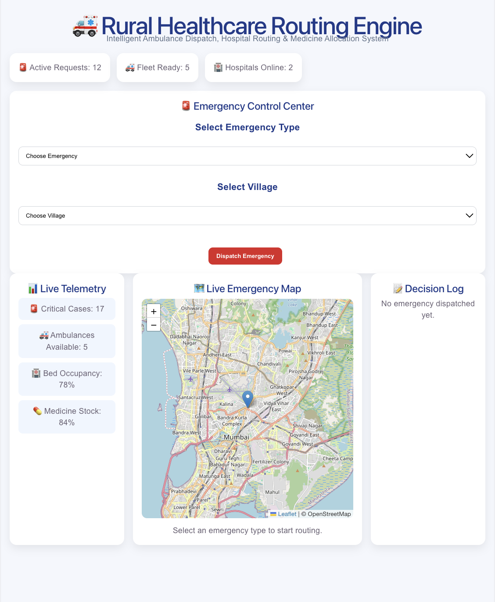
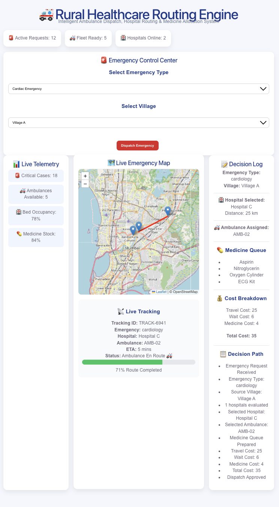
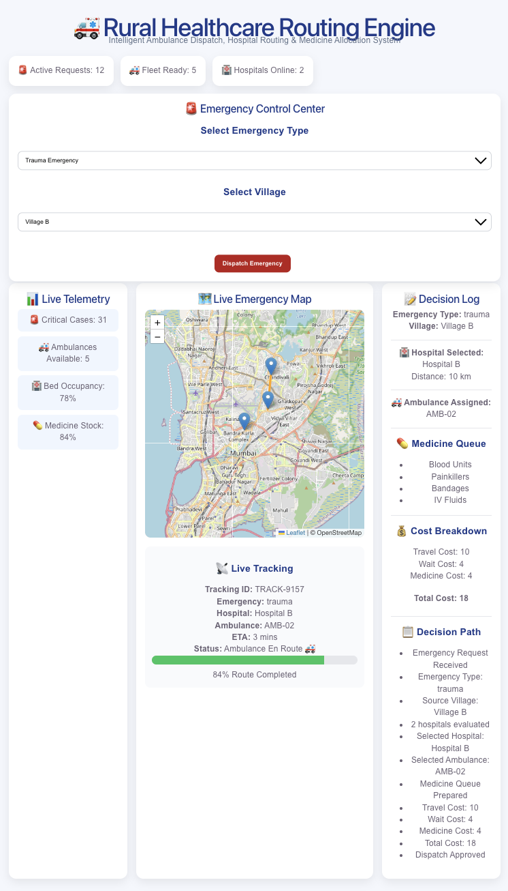
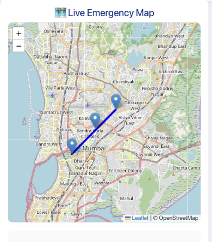
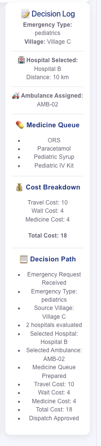

# 🚑 Dynamic Rural Healthcare Routing Engine

An intelligent healthcare dispatch and resource allocation platform designed for rural healthcare networks.

The system dynamically:

- Routes patients to suitable hospitals
- Dispatches the nearest available ambulance
- Allocates medicines based on emergency type
- Provides real-time tracking and telemetry
- Optimizes operational cost (Travel Time + Wait Time)

---

## Problem Statement

Rural healthcare systems face:

- Limited specialist doctors
- Scarce ambulance fleets
- Dynamic medicine inventories
- High emergency demand fluctuations

The objective is to intelligently route patients while minimizing:

Travel Cost + Wait Time

and ensuring emergency-specific treatment requirements are satisfied.

---
## ✨ Features

### 🗺️ Interactive Emergency Routing Map
- Real-time map visualization using React Leaflet
- Village, Ambulance, and Hospital markers
- Route visualization between patient location and assigned hospital
- Emergency-specific route highlighting

### 🚑 Intelligent Ambulance Dispatch
- Selects nearest available ambulance
- Dynamic resource allocation
- Capacity-aware dispatch decisions

### 🏥 Smart Hospital Selection
- Evaluates hospital capabilities
- Checks specialist availability
- Considers bed capacity
- Routes patients to the most suitable facility

### 💊 Dynamic Medicine Allocation
Different emergencies generate different medicine queues:

#### Cardiology
- Aspirin
- Nitroglycerin
- Oxygen Cylinder
- ECG Kit

#### Trauma
- Blood Units
- IV Fluids
- Bandages
- Painkillers

#### Pediatrics
- ORS
- Paracetamol
- Pediatric Syrup
- Pediatric IV Kit

### 📡 Live Tracking
- Tracking ID generation
- Ambulance status monitoring
- Estimated Time of Arrival (ETA)
- Route completion progress bar

### 📊 Live Telemetry Dashboard
- Active emergency cases
- Ambulance availability
- Hospital bed utilization
- Resource monitoring

### 📝 Decision Transparency
Every dispatch includes:
- Selected hospital
- Selected ambulance
- Cost calculation
- Medicine preparation log
- Routing explanation

## 🧠 Algorithmic Core

The platform uses graph-based routing and dynamic resource allocation to optimize emergency response.

### Routing Engine

The routing engine evaluates:

1. Emergency Type
2. Hospital Capability
3. Ambulance Availability
4. Resource Capacity
5. Operational Cost

The final decision minimizes:

Total Cost = Travel Time + Wait Time + Resource Cost

---

### Hospital Selection Algorithm

The system filters hospitals based on emergency requirements.

Example:

Cardiology Emergency

Hospital B:
- Distance: 10 km
- No Cardiologist Available

Hospital C:
- Distance: 25 km
- Cardiologist Available

Result:
Hospital C Selected

The algorithm prioritizes treatment capability over minimum distance.

---

### Ambulance Dispatch Algorithm

The engine selects:

Nearest Available Ambulance

while considering:

- Availability
- Distance
- Emergency Priority

---

### Dynamic Resource Allocation

The system dynamically allocates:

- Ambulances
- Hospital Beds
- Specialists
- Medicines

based on emergency type and current system state.

---

### Complexity Analysis

| Operation | Complexity |
|------------|------------|
| Priority Queue Operations | O(log n) |
| Hospital Selection | O(n) |
| Ambulance Selection | O(n) |
| Route Computation (Dijkstra) | O(E log V) |

---

## 🏗️ System Architecture
Patient Request
        │
        ▼
Emergency Classification
        │
        ▼
Resource Evaluation
        │
 ┌──────┴──────┐
 ▼             ▼
Hospital     Ambulance
Selection    Selection
 │             │
 └──────┬──────┘
        ▼
Medicine Allocation
        ▼
Dispatch Engine
        ▼
Live Tracking & Telemetry

## 🎯 Demo Scenario

### Emergency Request

Village A reports a **Critical Cardiac Emergency**.

### Available Hospitals

| Hospital | Distance | Cardiologist | Status |
|-----------|-----------|-------------|---------|
| Hospital B | 10 km | ❌ No | Rejected |
| Hospital C | 25 km | ✅ Yes | Selected |

### Available Ambulances

| Ambulance | Distance from Village |
|------------|----------------------|
| Ambulance A1 | 6 km |
| Ambulance A2 | 14 km |
| Ambulance A3 | 20 km |

Selected Ambulance: **A1**

### Medicine Allocation

Required Medicines:

- Cardiac Injection
- Oxygen Support
- ECG Monitoring Kit

Medicine stock is reserved immediately after hospital selection.

---

## 🔍 Decision Breakdown

Step 1:
Emergency classified as Cardiac Emergency.

Step 2:
Hospitals evaluated based on specialist availability.

Step 3:
Hospital B rejected due to unavailable cardiologist.

Step 4:
Hospital C selected despite longer distance.

Step 5:
Nearest available ambulance dispatched.

Step 6:
Required medicines reserved.

Step 7:
Route generated and visualized on live map.

Final Result:

Village A ➜ Ambulance A1 ➜ Hospital C

Estimated Response Time: 18 Minutes

## 📷 Application Screenshots

### Dashboard



### Cardiac Emergency Routing



### Trauma Emergency Routing



### Interactive Map



### Decision Log



## 🛠️ Tech Stack

### Frontend
- React.js
- Vite
- React Leaflet
- CSS3

### Algorithms
- Dijkstra Shortest Path
- Priority Queue Based Scheduling
- Dynamic Resource Allocation
- Capacity Aware Routing

### Data Management
- JavaScript Data Structures
- Graph-Based Routing Model

### Visualization
- OpenStreetMap
- Leaflet Maps
- Live Telemetry Dashboard

### Version Control
- Git
- GitHub

## ⚙️ Installation

### Clone Repository

```bash
git clone https://github.com/hritik2545/rural-healthcare-routing-engine.git

Navigate
cd rural-healthcare-routing-engine

Install Dependencies
npm run dev

Run Project
npm run dev

Application will start on:

http://localhost:5173


## 👥 Team Tech Rusher

### Team Members

- Hritik Jha

### Collaborators

- Twenitrix
- AyushRBuilds
- InvictusMF
## 🚀 Future Scope

The current prototype can be extended with:

- Real Ambulance GPS Tracking
- AI Based Demand Prediction
- Multi-District Routing
- Live Hospital API Integration
- Real Medicine Inventory Systems
- Doctor Shift Optimization
- A* Pathfinding Optimization
- Predictive Emergency Forecasting
- Government Healthcare Integration

## 🏆 Hackathon Highlights

✅ Dynamic Emergency Routing

✅ Specialist-Based Hospital Selection

✅ Capacity Aware Scheduling

✅ Real-Time Ambulance Dispatch

✅ Medicine Allocation Engine

✅ Interactive OpenStreetMap Visualization

✅ Decision Transparency Dashboard

✅ Dijkstra Based Route Optimization

✅ Rural Healthcare Resource Management

✅ Scalable Architecture for Large Networks

